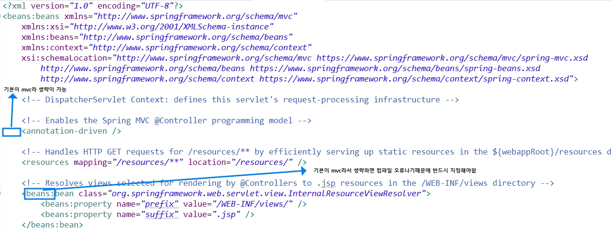

# 프레임워크
- 기본적인 뼈대나 근간을 이루는 코드들의 묶음
- 기본적인 틀은 정해져있고 동일한 결과를 얻을수있음
- 구조를 알고있어야 사용할수있음. 초기설정하는데 시간이 걸림.
- 서버중심으로 개발하는게 아니라서 가볍다는 특징이 있음

## 초기설정
1. java 11 version 다운
    - 오라클 로그인하고 windows로 다운로드
    - 기존 java와 같은 폴더에 저장하고 내pc - 속성 - 고급 시스템 설정 - 고급 - 환경변수 - 아래 사각형의 현경변수 편집 - jdk-17이라고 되있는걸 찾아서 편집 - java11이 있는 폴더 지정후 확인
2. <a href="https://github.com/spring-attic/toolsuite-distribution/wiki/Spring-Tool-Suite-3">Spring 3 버전 다운</a>
3. <a href="https://tomcat.apache.org/download-90.cgi#9.0.85">tomcat 9버전 다운</a>

## 프로젝트 생성
1. File - new - Spring Legacy Project
2. 프로젝트명을 적을때 회사도메인을 거꾸로해서 명칭함(그룹아이디와 아티펙트 아이디)
3. 프로젝트 생성후 `pom.xml`을 <u>먼저 확인</u>해줘야함
4. webapp : 정적 method가 들어가는 공간
- 각 용어의 설명
    - web.xml : 배포서술자 - 최초에 한번만 실행됨
    - Maven Dependencies : 빌드 관리도구. 개발부터 배포까지 빌드를 관리해주는 것
    - pom.xml : Maven이 어떻게 관리되는지 적혀있음
    - groupId : 회사명
    - artifactId : 만들고자하는 기능
    - properties : 어떤 형식으로 베포할지 설정하는 것. 일일이 지정하기 귀찮기에 el형식으로 나오게 만듬
     - org.slf4j-version : 표준인터페이스
    - dependencies : 실행하기위해 필요한 필수 요소들
    - component : 개발자에 의해 정의된 관리되고있는 빈
    - resources : 모든 정적 데이터를 보관하는 곳. Mapping에서 쓰이게되면 DispatcherServlet을 거치지않고 해당되는 위치에서 자원을 찾는 것

## 프로젝트 흐름도
 

