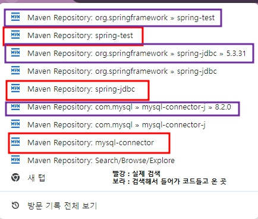

# 데이터베이스 연동
- 패키지 생성 후 `pom.xml`파일로 들어가 `dependency`로 추가해줌
- 예시
```
<!-- https://mvnrepository.com/artifact/com.mysql/mysql-connector-j -->
<dependency>
	<groupId>com.mysql</groupId>
	<artifactId>mysql-connector-j</artifactId>
    <version>8.2.0</version>
</dependency>
```
- `dependency`를 가지고올때 검색순서


- spring에서도 데이터베이스를 사용하기 위해 버전을 확인하고 맞는 버전으로 소프트웨어 다운
