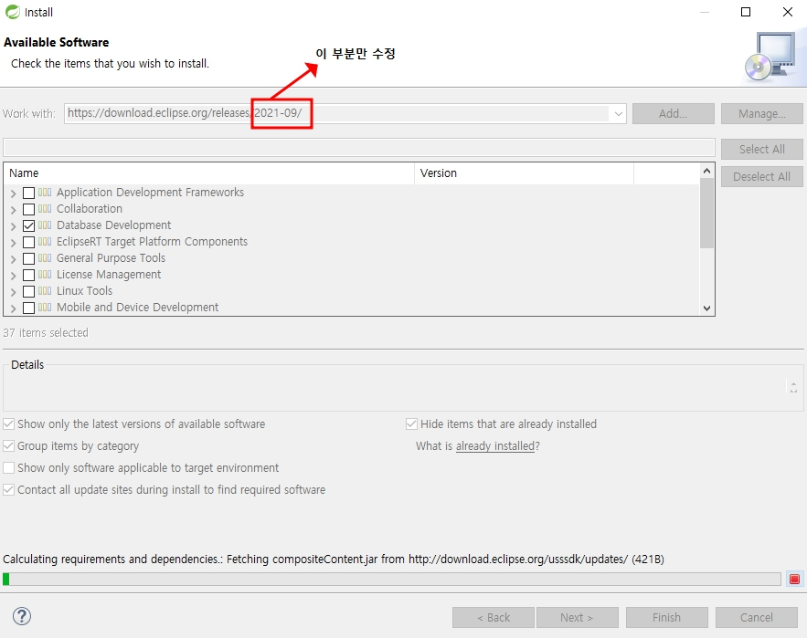

# 데이터베이스 연동
- 패키지 생성 후 `pom.xml`파일로 들어가 `dependency`로 추가해줌
- 예시
```
<!-- https://mvnrepository.com/artifact/com.mysql/mysql-connector-j -->
<dependency>
	<groupId>com.mysql</groupId>
	<artifactId>mysql-connector-j</artifactId>
    <version>8.2.0</version>
</dependency>
```
- `dependency`를 가지고올때 검색순서


- spring에서도 데이터베이스를 사용하기 위해 버전을 확인하고 맞는 버전으로 소프트웨어 다운


- 데이터 삽입할때 일일이 코드 작성하기 귀찮아서 다시 ORM Framework 설치
<a href="https://mvnrepository.com/artifact/org.mybatis/mybatis/3.5.15">mybatis 설치</a>
<a href="https://mvnrepository.com/artifact/org.mybatis/mybatis-spring">mybatis spring 설치</a>

- 코드를 들고 오고 난 뒤 커넥션을 들고올 객체를 생성
- `root-context.xml`에서 아래 문장을 추가
```
<bean class="org.mybatis.spring.SqlSessionFactoryBean">
	<property name="dataSource" />
</bean>
```